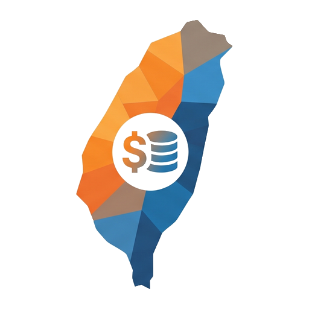
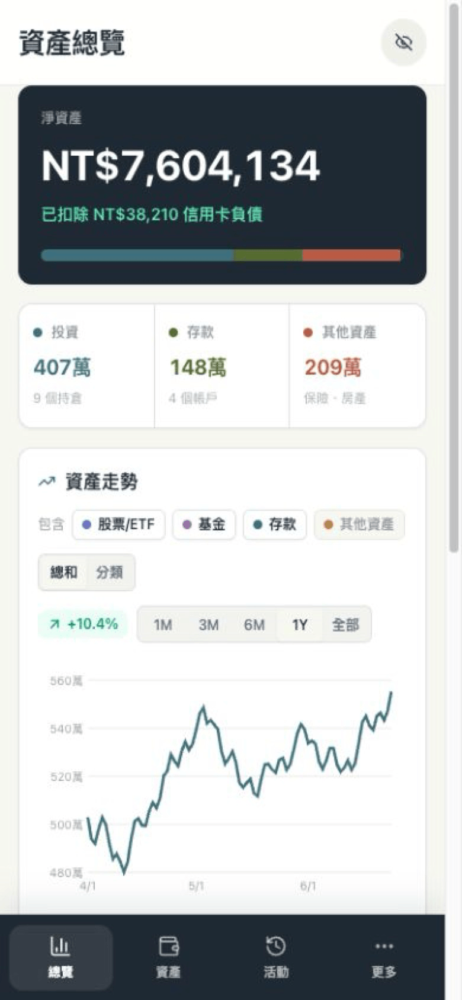
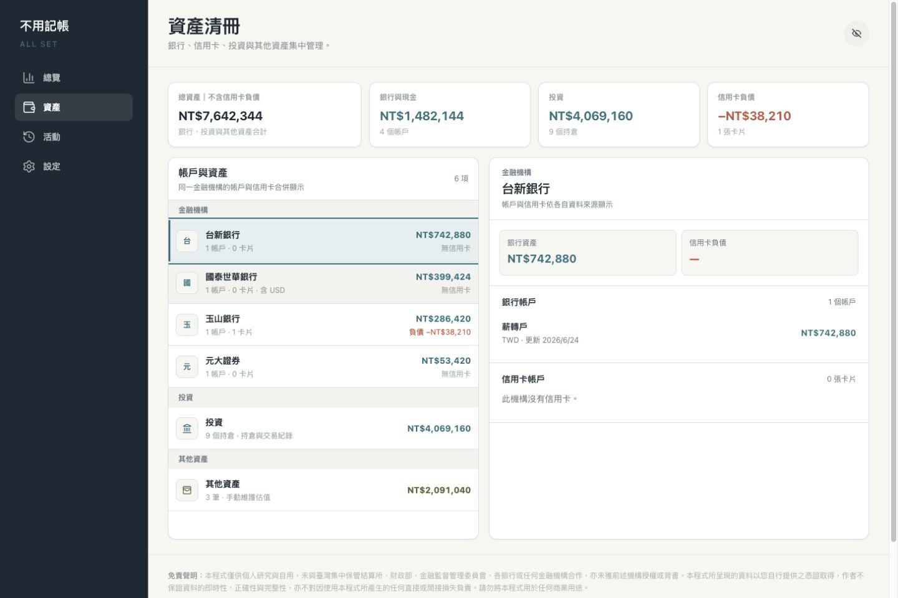
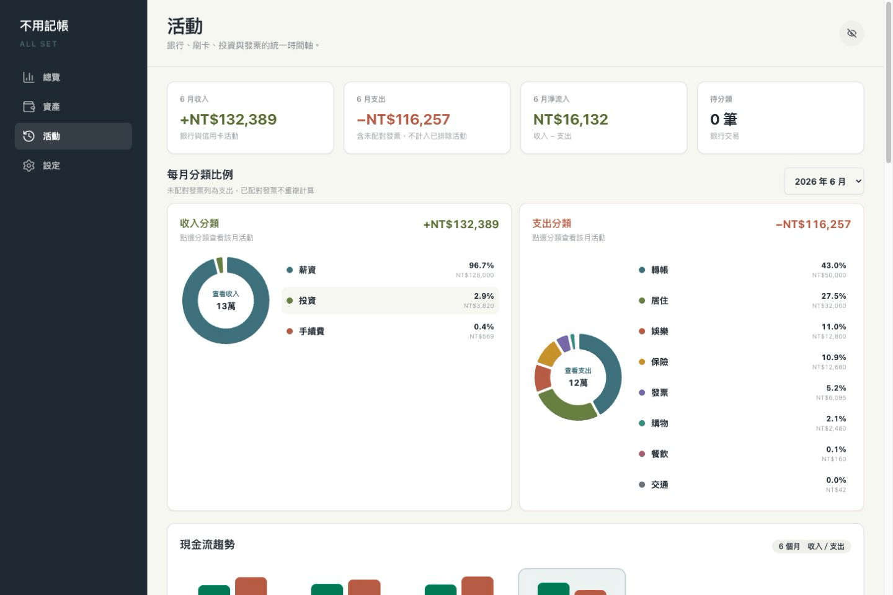
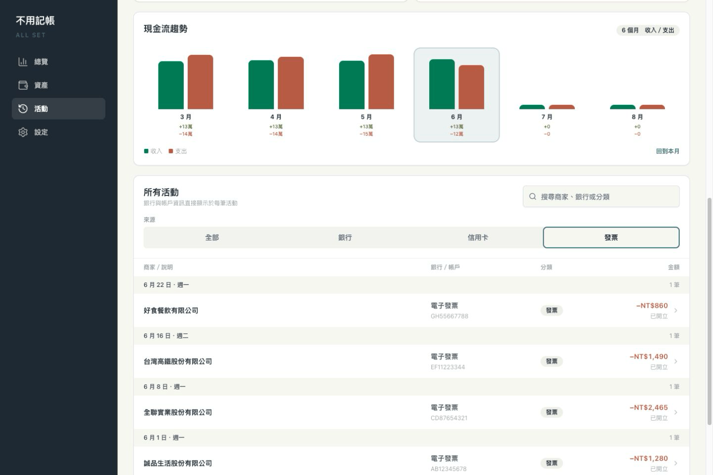
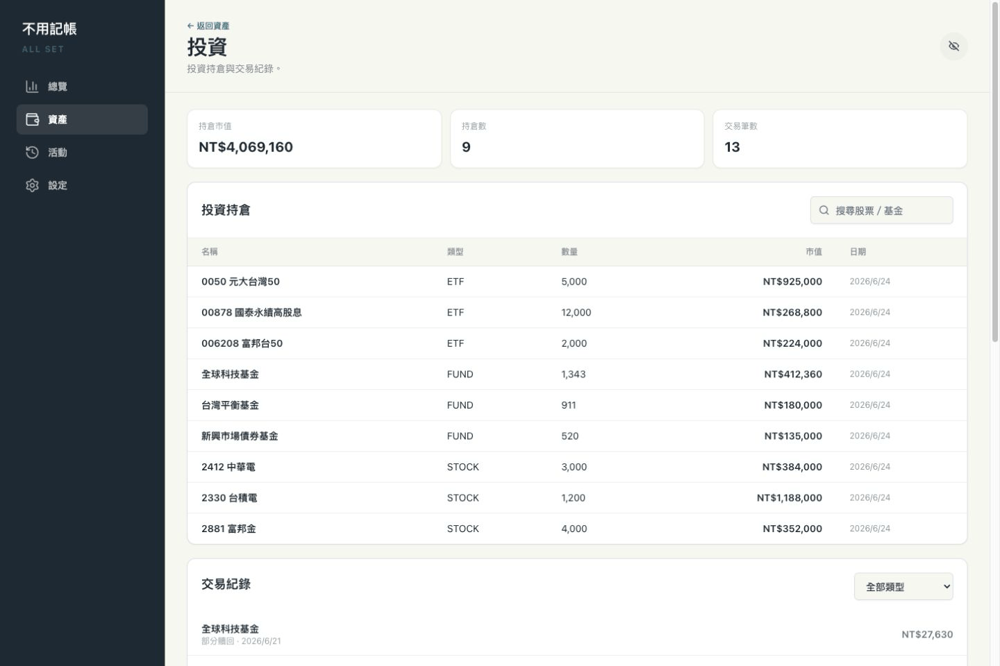
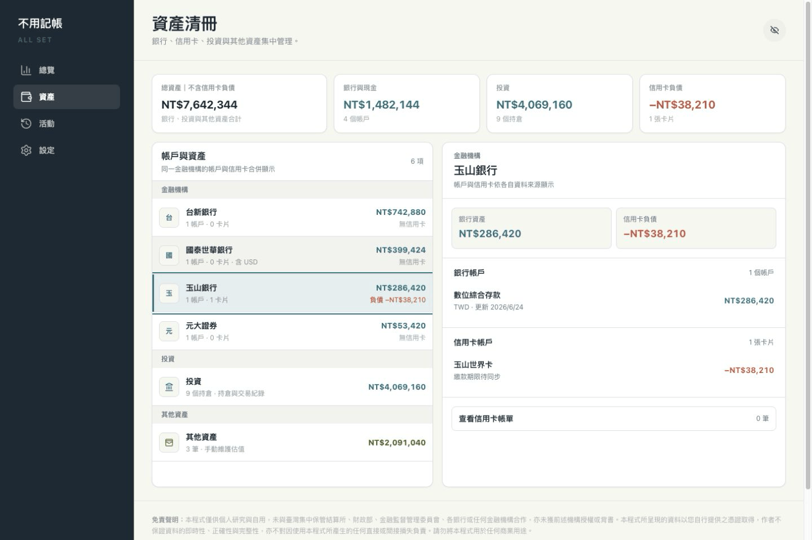
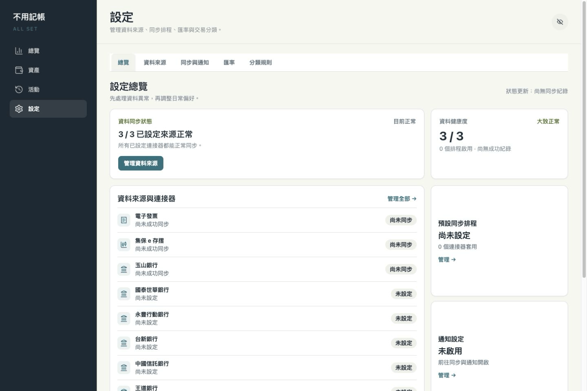

<p align="center">
  
</p>

# Taiwan Fin Hub

自架個人理財整合工具，將銀行、投資、信用卡與電子發票集中在同一個介面查看。

> 本專案以 [kevchentw/taiwan-fin-hub](https://github.com/kevchentw/taiwan-fin-hub) 為基礎，持續擴充資料來源、同步流程與 UI/UX。感謝原作者與貢獻者奠定專案基礎。

## 支援資料來源

| 資料來源     | 銀行帳戶與交易                                                                 | 信用卡帳務                               | 投資                          | 發票               | 驗證與登入                                              |
| ------------ | ------------------------------------------------------------------------------ | ---------------------------------------- | ----------------------------- | ------------------ | ------------------------------------------------------- |
| 電子發票載具 | —                                                                              | —                                        | —                             | 載具發票與品項明細 | 使用電子發票 App 帳號與密碼；登入狀態失效時會重新登入   |
| 集保 e 存摺  | 交割帳戶餘額與明細（[支援銀行列表](https://epassbook.tdcc.com.tw/zh/g1.aspx)） | —                                        | 股票、ETF、基金持倉與投資交易 | —                  | 首次或新裝置登入可能需要 Email／簡訊 OTP                |
| 玉山銀行     | 存款帳戶、餘額與交易                                                           | 信用卡帳單與刷卡交易                     | —                             | —                  | 透過 Browser Run 登入；session 失效時會重新登入         |
| 國泰世華銀行 | 存款帳戶、餘額與交易                                                           | 信用卡帳單與刷卡交易                     | —                             | —                  | 每次同步透過 Browser Run 登入；額外驗證需人工處理       |
| 永豐行動銀行 | —                                                                              | 信用卡總覽、近期帳單與未出帳消費         | —                             | —                  | Browser Run 搭配 Gemma 4 辨識驗證碼；失敗可人工輸入     |
| 台新銀行     | —                                                                              | 信用卡額度、帳單、已入帳與即時授權消費   | —                             | —                  | Browser Run 搭配 Gemma 4 辨識驗證碼；失敗可人工輸入     |
| 中國信託銀行 | 存款帳戶、餘額與交易                                                           | 信用卡帳單、已入帳、未出帳與即時消費明細 | —                             | —                  | 行動銀行 API 自動登入                                   |
| 王道銀行     | 活存、定存、餘額與交易                                                         | —                                        | —                             | —                  | App API 搭配 Gemma 4 辨識四位英數驗證碼；失敗可人工輸入 |

## 已知限制

- 連接器依賴各資料來源的網頁、App API 或回應格式；對方改版後可能需要更新連接器才能恢復同步。
- 銀行可能要求圖形驗證碼、OTP、裝置驗證或處理重複登入。系統不會繞過互動式安全驗證；需要人工處理時，同步會停止並標示為「需要處理」。
- 排程同步會沿用有效的登入狀態；永豐與台新 session 失效時會嘗試自動重新登入。王道每次透過 App API 建立短期登入狀態，手動與排程同步必要時都會接管其他登入中的裝置。台新與王道排程預設停用；台新與王道的自動登入可能取代正在使用的官方 session。
- 資料更新時間與完整性取決於外部服務，不應視為銀行、券商或財政部的即時正式對帳資料。

## 目前介面

以下畫面取自本分支目前版本，內容使用匿名 Demo 資料。

### 桌面／手機對照

| 桌面版總覽                                                                                                                         | 手機版總覽                                                                                                                                     |
| ---------------------------------------------------------------------------------------------------------------------------------- | ---------------------------------------------------------------------------------------------------------------------------------------------- |
| <a href="images/screenshots/01-dashboard.png"></a> | <a href="images/screenshots/08-overview-mobile.png"></a> |

### 更多畫面

| 資產                                                                                                       | 活動                                                                                                           | 發票                                                                                                           |
| ---------------------------------------------------------------------------------------------------------- | -------------------------------------------------------------------------------------------------------------- | -------------------------------------------------------------------------------------------------------------- |
| <a href="images/screenshots/05-assets.png"></a> | <a href="images/screenshots/07-activity.png"></a> | <a href="images/screenshots/02-invoices.png"></a> |

| 投資                                                                                                                 | 銀行                                                                                                   | 設定與資料來源                                                                                                           |
| -------------------------------------------------------------------------------------------------------------------- | ------------------------------------------------------------------------------------------------------ | ------------------------------------------------------------------------------------------------------------------------ |
| <a href="images/screenshots/03-investments.png"></a> | <a href="images/screenshots/04-bank.png"></a> | <a href="images/screenshots/06-settings.png"></a> |

## 技術架構

前端使用 Svelte 5、TypeScript、Tailwind CSS 4 與 shadcn-svelte。

後端執行於 Cloudflare Workers，以 Hono 提供 API，並整合 D1、Access、Browser Run、Workers AI、Cron Triggers 與 Queues。Cron 負責啟動排程輪次，每個 connector 由獨立的 Queue consumer invocation 逐一執行。

專案以 npm workspaces 管理 Web、Worker、共用型別、資料庫與連接器套件。

詳細設計請參考[後端架構](docs/002-backend-architecture.md)、[前端架構](docs/003-frontend-architecture.md)與[連接器開發](docs/004-connector-development.md)。

---

## 部署

**需要：** [Cloudflare 帳號](https://dash.cloudflare.com/signup)、[GitHub 帳號](https://github.com/signup)

> 玉山、國泰、永豐與台新連接器會使用 [Cloudflare Browser Run](https://developers.cloudflare.com/browser-run/)。Workers Free Plan 每日包含 10 分鐘瀏覽器使用量；大量或頻繁同步可能超過免費額度。

### 步驟一：一鍵部署

點擊下方按鈕。Cloudflare 會在你的 GitHub 帳號建立新的 repository、自動建立 D1 Database，並部署至 Cloudflare Workers：

[](https://deploy.workers.cloudflare.com/?url=https://github.com/TedLin1993/taiwan-fin-hub)

Cloudflare Builds 會在 build 階段自動檢查並建立排程同步所需的 Queue；正式部署腳本也會再次檢查。既有安裝更新到使用 Queue 的版本時不需要手動建立資源。

若使用 Cloudflare Workers Builds 自動產生的 API token，請在 **My Profile → API Tokens** 為該 token 增加帳戶層級的 **Queues Read** 與 **Queues Edit** 權限；這是 Cloudflare API 建立或檢查 Queue 的必要權限。

首次使用時，依畫面透過 **Git account → New Github Connection → Install & Authorize** 授權 Cloudflare 存取 GitHub。

部署設定只需先填入 `CONFIG_ENCRYPTION_KEY`；`TEAM_DOMAIN` 與 `POLICY_AUD` 會在步驟二取得：


`CONFIG_ENCRYPTION_KEY` 用於加密連接器帳密，可使用下列指令產生。請妥善保存；遺失或更換後需重新設定所有連接器。

```bash
openssl rand -hex 32
```

填寫完成後點擊 **Deploy**。

### 步驟二：啟用登入保護

1. 前往 [Cloudflare Dashboard](https://dash.cloudflare.com/) → **Workers & Pages**，選擇剛建立的 `taiwan-fin-hub`
2. 開啟 **Domains**，將 Worker URL 的存取模式從 **Public** 改為 **Restricted**
3. 若沒有 **Domains** 頁籤，請至 **Settings → Domains & Routes**，在 `workers.dev` 網址旁啟用 Cloudflare Access


切換後，Cloudflare 會顯示以下資訊：

- **Audience (aud)**：填入 Worker Secret `POLICY_AUD`
- **JWKs URL**：取出前面的網域作為 `TEAM_DOMAIN`，例如 `https://yourteam.cloudflareaccess.com`

前往 **Settings → Variables and secrets** 設定這兩個 Secret。若同一個 Worker 需要接受多個 Access Application，也可設定以逗號或空白分隔的 `POLICY_AUDS`。


### 步驟三：確認部署

1. 開啟 Worker 的 `workers.dev` 網址，確認會先要求 Cloudflare Access 登入
2. 登入後前往「連接器」頁面設定資料來源
3. 點擊同步以取得最新資料

### 步驟四：調整登入方式與有效期限

Cloudflare Access 可能預設使用 Email OTP，登入狀態通常會在 24 小時後過期。以下設定可改用 Cloudflare 帳號登入，並將登入期限延長至一個月。

#### 使用 Cloudflare 帳號登入

1. 前往 **Zero Trust → Integrations → Identity providers**，確認已有 **Cloudflare**；若沒有，點選 **Add new identity provider → Cloudflare**
2. 啟用 **Restrict to account members** 並儲存，避免非此 Cloudflare 帳號成員登入
3. 前往 **Zero Trust → Access controls → Applications → taiwan-fin-hub → Authentication**，將登入方式設為 **Cloudflare**
4. 若只使用此登入方式，可啟用 **Apply instant authentication**，略過登入方式選擇頁

新建立的 Zero Trust organization 通常已預設啟用 Cloudflare identity provider，不需要另外新增。

#### 將登入期限延長至一個月

1. 在 `taiwan-fin-hub` Access Application 中，將 **Session Duration** 設為 **1 month**
2. 前往 **Zero Trust → Access controls → Access settings**，將 **Global session duration** 設為 **1 month**
3. 若 Access Policy 另外設定了 Session Duration，也要改為一個月，否則會以較短的期限為準

---

## 自動更新

Cloudflare 的 Deploy to Cloudflare 流程目前不會將 `.github/workflows` 複製到新 repository，因此首次部署可以正常使用，但需要完成下方的一次性設定才會啟用版本更新。

### 一次性啟用更新功能

不需要修改程式碼，可直接在 GitHub 網頁完成：

1. 在你的部署 repository 開啟 [`deploy/github/sync-upstream.yml`](deploy/github/sync-upstream.yml)，點擊 **Raw** 並複製完整內容
2. 回到 repository 首頁，選擇 **Add file → Create new file**
3. 將檔名設為 `.github/workflows/sync-upstream.yml`，貼上剛才複製的內容並 commit 至 `main`
4. 前往 **Settings → Actions → General → Workflow permissions**，確認已允許 GitHub Actions 讀寫 repository 內容

若已將 repository clone 至本機，也可以執行：

```bash
mkdir -p .github/workflows
cp deploy/github/sync-upstream.yml .github/workflows/sync-upstream.yml
git add .github/workflows/sync-upstream.yml
git commit -m "啟用版本自動更新"
git push
```

完成一次性設定後，可以前往部署 repository 的 **Actions → Sync Latest Version → Run workflow**，點擊 **Run workflow** 立即更新。workflow 也會在每天台灣時間 **04:15** 自動執行。

每次執行時，workflow 會：

1. 取得 `TedLin1993/taiwan-fin-hub` 的最新 `main`
2. 以前次同步版本為基準進行安全三方合併
3. 有新版本時將更新推送至部署 repository
4. 由 Cloudflare Workers Builds 自動重新部署

Cloudflare 建立的 repository 與本專案可能沒有共同 Git 歷史。首次同步遇到此情況時，workflow 只會在下列檢查都通過後接軌：初始檔案能對應本專案的某個上游版本，而且部署後除了 `.github/workflows` 以外沒有自行修改。同步前會先建立 `backup-before-first-upstream-sync` branch，且已存在時不會覆寫。

每次同步會在 commit message 記錄對應的上游版本，後續以該版本、部署 repository 目前內容與最新版上游進行三方合併。同步 commit 只接在部署 repository 自己的歷史後方，不會將上游 commit history 當成 parent，也不會使用 force push。若你修改過程式碼並與上游發生衝突，workflow 會在修改 working tree 前停止且不會推送；請從 Actions 執行紀錄查看衝突並手動處理。

版本同步會保留部署 repository 目前安裝的 `.github/workflows`，不會自動覆蓋 workflow 本身；更新流程有修正版時，請依照下方說明手動替換。

若 Actions 顯示 `fatal: refusing to merge unrelated histories`，代表 repository 仍在使用舊版 workflow。請依照上方步驟，以最新的 [`deploy/github/sync-upstream.yml`](deploy/github/sync-upstream.yml) 內容取代 `.github/workflows/sync-upstream.yml` 後再執行。

---

## 本機開發

本機設定不納入版本控制。第一次啟動前，建立私人設定檔，將 `wrangler.local.toml` 的 D1 Database ID 換成開發用資料庫，並在 `.dev.vars` 設定自己的 `CONFIG_ENCRYPTION_KEY`：

```bash
cp apps/worker/wrangler.local.toml.example apps/worker/wrangler.local.toml
cp apps/worker/.dev.vars.example apps/worker/.dev.vars
npm install
npx wrangler login
npm run dev
```

Worker 程式會在本機執行；範例設定中的 D1 與 Workers AI 會透過 remote binding 連到 Cloudflare。請使用開發用 D1，避免直接操作正式資料。

中信行動銀行的 TLS endpoint 無法由 local workerd 直接連線，因此 `npm run dev` 會自動啟動僅監聽 `127.0.0.1`、限制目的端點並使用單次隨機 token 的 Node relay。正式 Worker 不會使用此 relay。

若需從本機部署至既有 D1，請複製 `wrangler.toml` 為被忽略的 `wrangler.private.toml`、加入 `database_id`，再以 `wrangler --config wrangler.private.toml` 執行遠端遷移或部署。

---

## 安全機制

- 一般模式下，Cloudflare Access 是唯一登入閘道；Worker 會驗證 JWT 的 RS256 簽章、issuer、audience 與有效期限，失敗時回傳 `401`。
- 連接器帳密會以 `CONFIG_ENCRYPTION_KEY` 衍生的金鑰進行 AES-GCM 加密，D1 只儲存密文。
- 目前不支援金鑰輪替；更換或遺失 `CONFIG_ENCRYPTION_KEY` 後，既有設定無法解密，必須重新設定連接器。

---

## 免責聲明

本程式僅供個人研究與自用，未與臺灣集中保管結算所、財政部、金融監督管理委員會、各銀行或任何金融機構合作，亦未獲前述機構授權或背書。本程式所呈現之資料以您自行提供之憑證取得，作者不保證資料之即時性、正確性與完整性，亦不對因使用本程式所產生之任何直接或間接損失負責。請勿將本程式用於任何商業用途。

---

## License

本專案採用 [MIT License](LICENSE)，並保留原專案的著作權與授權聲明。
